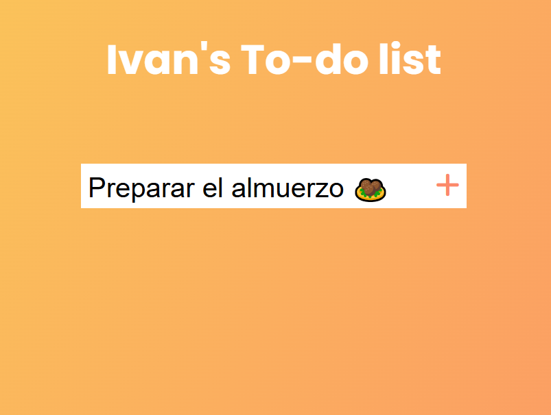
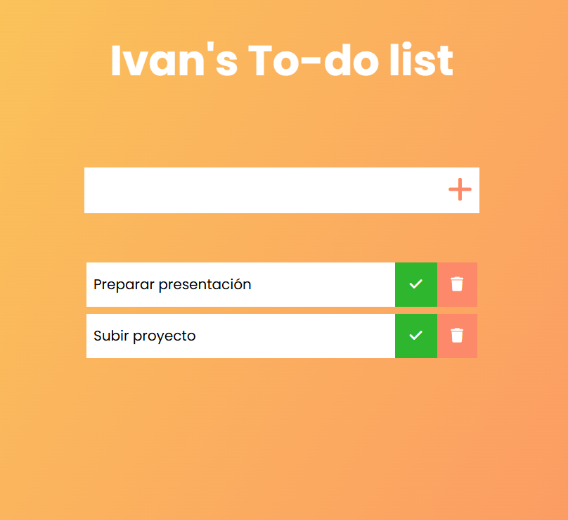
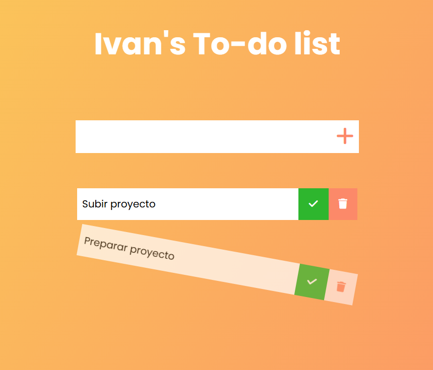

# 📌 To-Do-List

## 📌 Descripción

Aplicación de lista de tareas desarrollada en HTML, CSS y JavaScript. Permite crear, editar y eliminar tareas, almacenándolas en el navegador con LocalStorage.

---

## 🛠️ Tecnologías utilizadas

- **HTML5**
- **CSS3 (Flexbox / Animaciones)**
- **JavaScript (ES6+)**

---

## 🎯 Características

- ✅ Interfaz responsive
- ✅ Guardado de datos en LocalStorage

---

## 📸 Capturas de pantalla

---

## 🚀 Demo en vivo

👉 [Ver proyecto en GitHub Pages](https://ivan-develops.github.io/ToDoList/)
